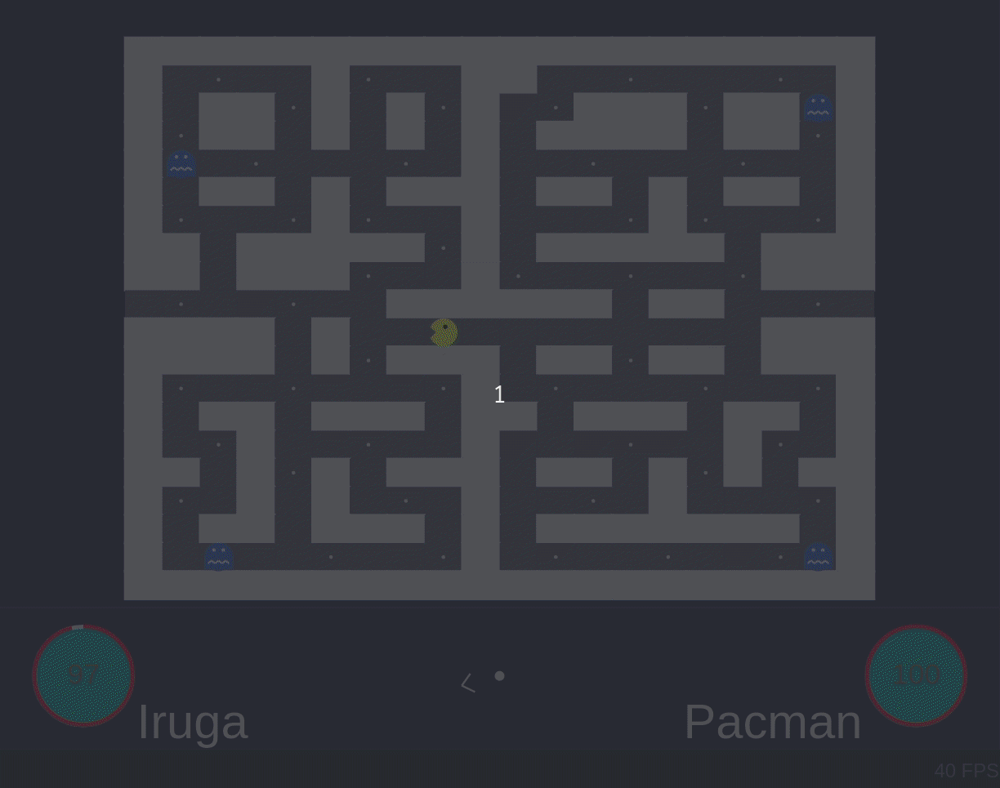
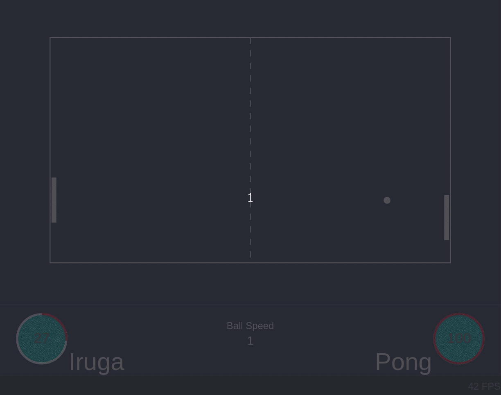
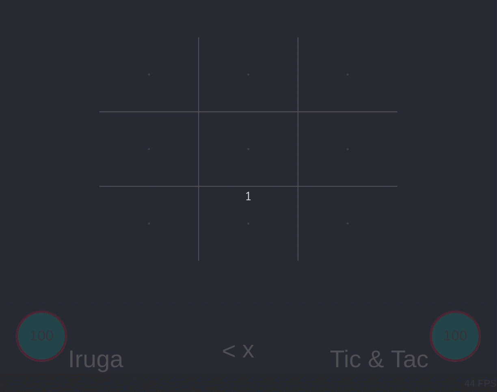
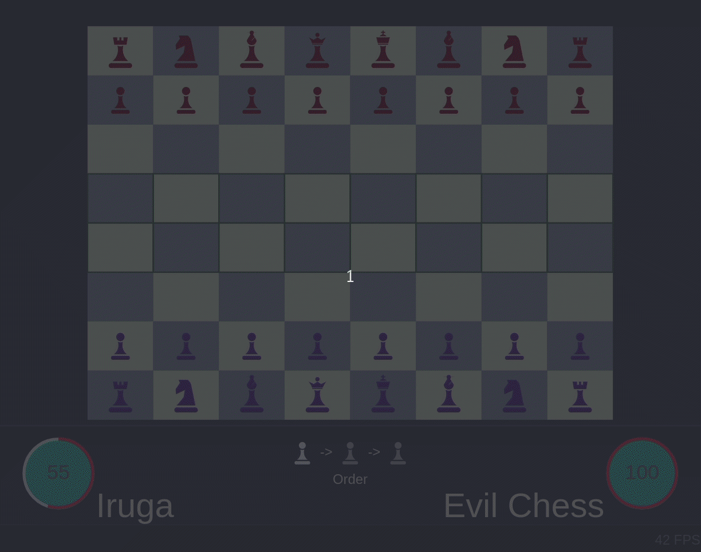
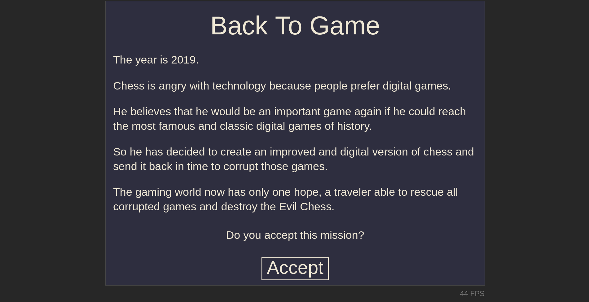
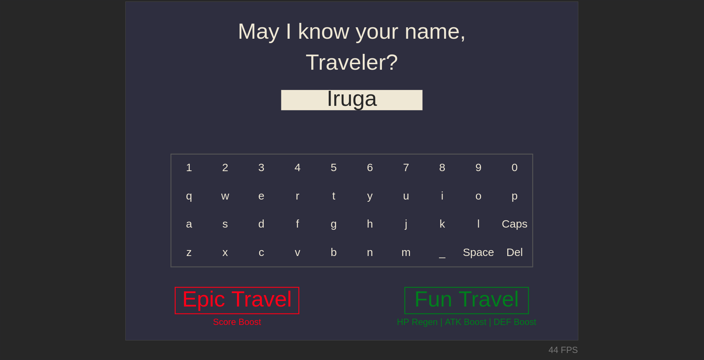

# Back to Game

Game developed for **js13kGames** [2019 JavaScript Game Coding Competition](https://2019.js13kgames.com), with honor mention ([#95](https://js13kgames.com/entries/back-to-game)).

The objective was to develop a HTML + CSS + JS game with 13Kb or less and related to **Back** subject.

You can play it [here](https://backtogame.ighour.me).

## About

In a world ruled by digital games, one of them travels to the past and tries to corrupt other digital games.

You are the only hope for our gaming world.

Go back to past and destroy the evil!

## Available Games

* **Pacman** : run from Pacman until you have enough power.

* **Pong** : get away from the field or die trying. Be careful with the boss bars.

* **Tic Tac Toe** : enforce the game match to draw and avoid the boss winning as player X and player 0.

* **Chess** : eat pieces from both sides and avoid your enemies.

## Screenshots

* **Introduction**

* **Choose Name**

* **Game Over**

## Versions

### v1.0

* Started project.

* Added basic Tic Tac Toe game.

* Added start screen.

* Added basic game engine.

* Added game over screen.

* Added name input.

* Added basic Pong game.

### v1.1

* Optimized gameplay.

* Optimized game engine with lifecycle and time control (delta).

* Improved Tic Tac Toe and Pong gameplay.

* Added FPS meter.

### v1.2

* Optimized Pong gameplay.

* Added touch support and improved game screen responsivity.

* Added virtual keyboard.

* Added Pacman game.

### v1.3

* Optimized game design.

* Added player life circle.

* Fixed Pacman and Tic Tac Toe minor issues.

* Added Chess game.

* Optimized tutorials.

* Optimized introduction.

* Added game tips.

### v1.4

* Added score.

* Optimized gameover screen.

* Added revive feature.

* Added Coil monetization.

* Optimized games.

### v1.5

* Added Fun Game mode, with HP regen and ATAK/DEF bonus.

### v1.6

* Improved tutorials with game controls.

* Optimized fun game mode.

* Optimized Pacman and Pong UI.

### v1.7/v1.8/v1.9

* Added responsive screen on height.

* Fixed minor UI bugs.

### v2.0

* Make it easier in Fun Mode.

* Minor fixes and updates.

## Built With

* [HTML](https://www.w3schools.com/html/html5_intro.asp)
* [JavaScript](https://www.w3schools.com/js/)
* [CSS](https://www.w3schools.com/css/)
* [WebPack](https://webpack.js.org/)